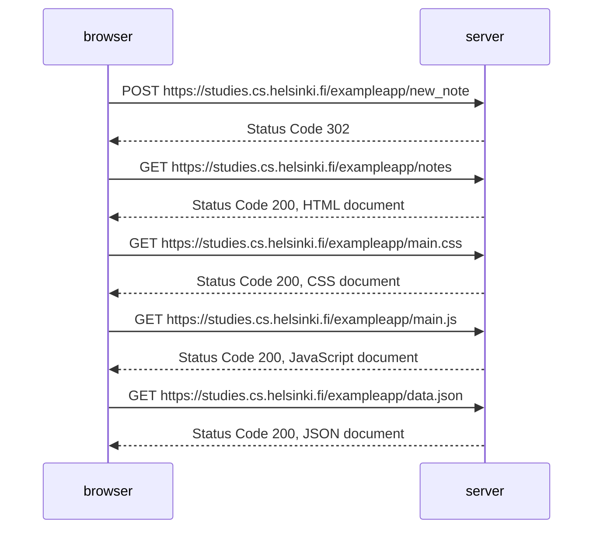

# fullstackopen
Exercises for Full Stack Open, University of Helsinki

```mermaid
sequenceDiagram
participant browser
participant server

browser->>server:  POST https://studies.cs.helsinki.fi/exampleapp/new_note
server-->>browser: Status Code 302
browser->>server:  GET https://studies.cs.helsinki.fi/exampleapp/notes
server-->>browser: Status Code 200, HTML document

browser->>server: GET https://studies.cs.helsinki.fi/exampleapp/main.css
server-->>browser: Status Code 200, CSS document

browser->>server: GET https://studies.cs.helsinki.fi/exampleapp/main.js
server-->>browser: Status Code 200, JavaScript document

browser->>server: GET https://studies.cs.helsinki.fi/exampleapp/data.json
server-->>browser: Status Code 200, JSON document
```
